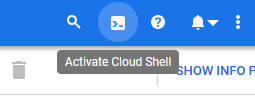
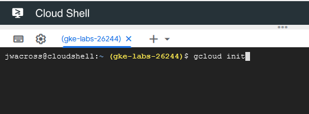
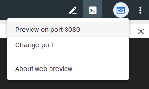
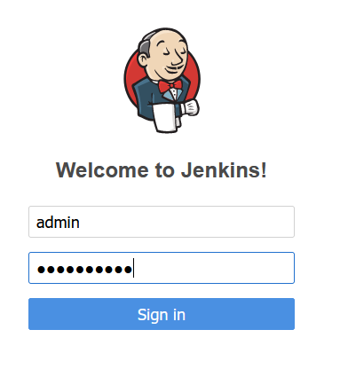

# Lab: Build a Continuous Deployment Pipeline with Jenkins and Google Kubernetes Engine

This was originally forked from this [repo](https://github.com/GoogleCloudPlatform/continuous-deployment-on-kubernetes), but has since been updated and corrected with current information and best practices. Also, we'll be building in Jenkins using a repo from GitHub, but you can use a private container registry, if you'd like.

## Introduction

This guide will take you through the steps necessary to continuously deliver your software to end users by leveraging [Google Kubernetes Engine](https://cloud.google.com/kubernetes-engine/) and [Jenkins](https://jenkins.io) to orchestrate the software delivery pipeline.
If you are not familiar with basic Kubernetes concepts, have a look at [Kubernetes 101](http://kubernetes.io/docs/user-guide/walkthrough/).

In order to accomplish this goal you will use the following Jenkins plugins, which will be installed later with our custom [Helm chart](https://helm.sh/docs/intro/):
  - [Jenkins Kubernetes Plugin](https://wiki.jenkins-ci.org/display/JENKINS/Kubernetes+Plugin) - start Jenkins build executor containers in the Kubernetes cluster when builds are requested, terminate those containers when builds complete, freeing resources up for the rest of the cluster
  - [Jenkins Pipelines](https://jenkins.io/solutions/pipeline/) - define our build pipeline declaratively and keep it checked into source code management alongside our application code
  - [Google Oauth Plugin](https://wiki.jenkins-ci.org/display/JENKINS/Google+OAuth+Plugin) - allows you to add your google oauth credentials to jenkins

In order to deploy the application with [Kubernetes](http://kubernetes.io/) you will use the following resources:
  - [Deployments](http://kubernetes.io/docs/user-guide/deployments/) - replicates our application across our kubernetes nodes and allows us to do a controlled rolling update of our software across the fleet of application instances
  - [Services](http://kubernetes.io/docs/user-guide/services/) - load balancing and service discovery for our internal services
  - [Ingress](http://kubernetes.io/docs/user-guide/ingress/) - external load balancing and SSL termination for our external service
  - [Secrets](http://kubernetes.io/docs/user-guide/secrets/) - secure storage of non public configuration information, SSL certs specifically in our case

## Prerequisites

1. A Google Cloud Platform Account, with valid billing information. $398 CAD is granted to free trial users.
2. Create a new Google Cloud Platform project: [https://console.developers.google.com/project](https://console.developers.google.com/project)
3. [Enable the Compute Engine, Container Engine, and Container Builder APIs](https://console.cloud.google.com/flows/enableapi?apiid=compute_component,container,cloudbuild.googleapis.com)

## Setting up your Google Cloud Shell

In this section you will start your [Google Cloud Shell](https://cloud.google.com/cloud-shell/docs/) and clone the lab code repository to it.

1. Click the Google Cloud Shell icon in the top-right and wait for your shell to open:

  

2. When the shell is open, set your default account, project and compute zone. For these labs, set the default zone to 'us-east1-d':

  ```shell
  $ gcloud init
  ```
  
  

  You may also need to configure your shell to use the correct project. e.g.:
  
  ```
  $ gcloud config set project gke-labs-26244
  ```
  
3. Clone the lab repository in your cloud shell, then `cd` into that dir:

  ```shell
  $ git clone https://github.com/KelfeinX/gke-labs.git
  Cloning into 'gke-labs'...
  ...

  $ cd gke-labs
  ```

## Creating a Kubernetes Cluster

You'll use Google Container Engine to create and manage your Kubernetes cluster. Provision the cluster with `gcloud`:

```shell
    gcloud container clusters create jenkins-ci --machine-type n1-standard-2 --num-nodes 2 --zone us-east1-d --scopes "https://www.googleapis.com/auth/source.read_write,cloud-platform"
```

Once that operation completes download the credentials for your cluster using the [gcloud CLI](https://cloud.google.com/sdk/):

```shell
$ gcloud container clusters get-credentials jenkins-ci --zone us-east1-d --project=$(gcloud config get-value project)
Fetching cluster endpoint and auth data.
kubeconfig entry generated for jenkins-ci.
```

Confirm that the cluster is running and `kubectl` is working by listing the cluster info:

```shell
$ gcloud container clusters list
NAME        LOCATION    MASTER_VERSION  MASTER_IP      MACHINE_TYPE   NODE_VERSION    NUM_NODES  STATUS
jenkins-ci  us-east1-d  1.13.11-gke.14  34.73.126.148  n1-standard-2  1.13.11-gke.14  2          RUNNING
$ kubectl cluster-info
Kubernetes master is running at https://34.73.126.148
GLBCDefaultBackend is running at https://34.73.126.148/api/v1/namespaces/kube-system/services/default-http-backend:ht
tp/proxy
Heapster is running at https://34.73.126.148/api/v1/namespaces/kube-system/services/heapster/proxy
KubeDNS is running at https://34.73.126.148/api/v1/namespaces/kube-system/services/kube-dns:dns/proxy
Metrics-server is running at https://34.73.126.148/api/v1/namespaces/kube-system/services/https:metrics-server:/proxy
```

## Installing Helm

In this lab, you will use Helm to install Jenkins from the Charts repository. Helm is a package manager that makes it easy to configure and deploy Kubernetes applications.  Once you have Jenkins installed, you'll be able to set up your CI/CD pipleline.

Now with Helm v3, this section is now only half as long and far less complicated! (no more Tiller!)

1. Download and run the new helm install script

    ```shell
    curl https://raw.githubusercontent.com/helm/helm/master/scripts/get-helm-3 > get_helm.sh
    chmod 700 get_helm.sh
    ./get_helm.sh
    ```

2. Afterwards, ensure Helm is properly installed by running the following command:

    ```shell
    helm version
    version.BuildInfo{Version:"v3.0.2", GitCommit:"19e47ee3283ae98139d98460de796c1be1e3975f", GitTreeState:"clean", GoVersion:"go1.13.5"}
    ```
    
3. Add yourself as a cluster administrator in the cluster's RBAC so that you can give Jenkins permissions in the cluster:
    
    ```shell
    kubectl create clusterrolebinding cluster-admin-binding --clusterrole=cluster-admin --user=$(gcloud config get-value account)
    ```

## Installing and Configuring Jenkins

You will use a custom [values file](https://github.com/kubernetes/helm/blob/master/docs/chart_template_guide/values_files.md) to add the GCP specific plugin necessary to use service account credentials to reach your Cloud Source Repository.

1. Use the Helm CLI to deploy the chart with your configuration set.

    ```shell
    helm install --name jenkins stable/jenkins -f charts/jenkins.yaml --wait
    ```

2. Once that command completes ensure the Jenkins pod goes to the `Running` state and the container is in the `READY` state:

    ```shell
    $ kubectl get all
    NAME                          READY   STATUS    RESTARTS   AGE
    pod/jenkins-85ddb8fd5-b65dn   1/1     Running   0          108s

    NAME                    TYPE        CLUSTER-IP      EXTERNAL-IP   PORT(S)     AGE
    service/jenkins         ClusterIP   10.35.249.227   <none>        8080/TCP    108s
    service/jenkins-agent   ClusterIP   10.35.246.248   <none>        50000/TCP   108s
    service/kubernetes      ClusterIP   10.35.240.1     <none>        443/TCP     5d16h

    NAME                      READY   UP-TO-DATE   AVAILABLE   AGE
    deployment.apps/jenkins   1/1     1            1           108s

    NAME                                DESIRED   CURRENT   READY   AGE
    replicaset.apps/jenkins-85ddb8fd5   1         1         1       108s
    ```
    
3. Configure the Jenkins service account to be able to deploy to the cluster. 

    ```shell
    $ kubectl create clusterrolebinding jenkins-deploy --clusterrole=cluster-admin --serviceaccount=default:jenkins
    clusterrolebinding.rbac.authorization.k8s.io/jenkins-deploy created
    ```

4. Run the following command to setup port forwarding to the Jenkins UI from the Cloud Shell

    ```shell
    export POD_NAME=$(kubectl get pods --namespace default -l "app.kubernetes.io/component=jenkins-master" -l "app.kubernetes.io/instance=jenkins" -o jsonpath="{.items[0].metadata.name}") && kubectl port-forward $POD_NAME 8080:8080 >> /dev/null &
    ```

Another way of doing this:

    ```shell
    gcloud container clusters get-credentials jenkins-ci --zone us-east1-d --project=$(gcloud config get-value project) && kubectl port-forward $(kubectl get pod --selector="app.kubernetes.io/component=jenkins-master,app.kubernetes.io/instance=jenkins" --output jsonpath='{.items[0].metadata.name}') 8080:8080 >> /dev/null &
    ```

We are using the [Kubernetes Plugin](https://wiki.jenkins-ci.org/display/JENKINS/Kubernetes+Plugin) so that our builder nodes will be automatically launched as necessary when the Jenkins master requests them.
Upon completion of their work they will automatically be turned down and their resources added back to the clusters resource pool.

Notice that this service exposes ports `8080` and `50000` for any pods that match the `selector`. This will expose the Jenkins web UI and builder/agent registration ports within the Kubernetes cluster.
Additionally the `jenkins-ui` services is exposed using a ClusterIP so that it is not accessible from outside the cluster.

## Connecting to Jenkins

1. The Jenkins helm chart will automatically create an admin password for you. To retrieve it, run:

    ```shell
    printf $(kubectl get secret jenkins -o jsonpath="{.data.jenkins-admin-password}" | base64 --decode);echo
    ```

2. To get to the Jenkins user interface, click on the Web Preview button in the cloud shell, then click “Preview on port 8080”:



Alternatively, navigate to: https://ssh.cloud.google.com/devshell/proxy?port=8080 Your Jenkins frontend should now have a generated URL that can be access externally; such as https://8080-dot-10187644-dot-devshell.appspot.com/ You should now be able to log in with username `admin` and your auto generated password.



## Preparing your GitHub Repo Webhook

If you haven't already done so, fork this GitHub repository and configure it such that GitHub automatically notifies Jenkins about new commits to the repository via a webhook.

  - Log in to GitHub and create a new repository. Note the HTTPS URL to the repository.


  - Click the "Settings" tab at the top of the repository page.
  - Select the "Webhooks" sub-menu item. Click "Add webhook".
  - In the "Payload URL" field, enter the URL https://HOSTNAME/github-webhook/, replacing the HOSTNAME placeholder with the hostname of your Jenkins deployment.
  


  - Ensure that "Just the push event" radio button is checked and save the webhook.

## Setting up a Pipeline in Jenkins

At this point, you are ready to start setting up your Jenkins pipeline. Follow the steps below to create a new project.

  - Log in to Jenkins (if you're not already logged in).
  - Click "New item". Enter a name for the new project and set the project type to "Pipeline". Click "OK" to proceed.


  - Select the "General" tab on the project configuration page and check the "GitHub project" checkbox. Enter the complete URL to your GitHub project.
  - Select the "Build triggers" tab on the project configuration page and check the "GitHub hook trigger for GITScm polling" checkbox. 


  - Select the "Pipeline" tab on the project configuration page and set the "Definition" field to "Pipeline script from SCM". Set the "SCM" field to "Git" and enter the GitHub repository URL. Set the branch specifier to "*/master". This configuration tells Jenkins to look for a pipeline script named Jenkinsfile in the code repository itself.
  


  - Save the changes.

At this point, your pipeline project has been created, but doesn't actually have any credentials or data to operate on. The next steps will add this information.

## Adding credentials to Jenkins

This step will walk you through adding credentials to the Jenkins credentials store, so that the pipeline is able to communicate with the Kubernetes cluster and the Docker Hub registry. Follow the steps below:

  - Navigate to the Jenkins dashboard and select the "Credentials" menu item.
  - Select the "System" sub-menu" and the "Global credentials" domain.
  - Click the "Add credentials" link. Select the "Username with password" credential type and enter your Docker Hub username and password in the corresponding fields. Set the "ID" field to dockerhub. Click "OK" to save the changes.


  - In the Jenkins UI, Click “Credentials” on the left
  - Click either of the “(global)” links (they both route to the same URL)
  - Click “Add Credentials” on the left
  - From the “Kind” dropdown, select “Google Service Account from metadata”
  - Click “OK”


With the credentials added, you're now ready to commit some code and test the pipeline.

At this point, you are ready to have Jenkins build and deploy your application. Since you already configured a GitHub webhook trigger, committing your code to GitHub will automatically trigger the pipeline.

## Rolling Update and Rollback

TODO: We're going to deploy a new version of our app on Kubernetes by scaling down the old version, and then scaling up the updated one. We'll also revert with a rollback to the previous app version.

Things to consider:

* What is the Docker image you want to deploy for roll back?
* How can you interact directly with the Kubernetes to trigger the deployment?

## Clean up

Clean up is really easy, but also super important: if you don't follow these instructions, you will continue to be billed for the Google Container Engine cluster you created.

To clean up, navigate to the [Google Developers Console Project List](https://console.developers.google.com/project), choose the project you created for this lab, and delete it. That's it.

If you just want to delete the pods but not the entire project, you can do that with helm:

    ```shell
    helm delete jenkins --purge
    ```
